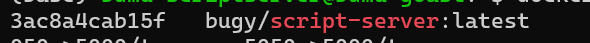

### Preparing the input files
#### Input reads
Raw files are found in `/Storage/RAW/SC2`.
In the example below, the `parent directory` of `batch 98` is `14NOV2024_SC2_WGS_BATCH_98_CMR_JMG_SMT` with a sub-directory `no_sample_id` and subsequent sub-directory `20241114_1710_MN37014_FAW70366_b923bfb9` 


Create a new directory in `/Storage/PROCESSED/sc2/BDMU_1`
```
mkdir -p /Storage/PROCESSED/sc2/BDMU_1/14NOV2024_SC2_WGS_BATCH_98_CMR_JMG_SMT
```

Transfer the `fastq_pass` directory and `final_summary_*.txt` file to the new directory. <br>
The new directory should look like the following.


#### Barcode file

Check `assets/sample_barcode.csv`

| Header        | Description               | Required? |   Options  |
|---------------|---------------------------|-----------|-----------|
| ont_barcode   | assigned barcode of the sample to analyze | yes | check REDCap |
| local_id      | assigned local ID (REDCap) of the sample to analyze | yes | check REDCap |
| type          | whether a sample is a negative control or positive SC2 sample | yes | `positive` or `negative` |
| central_id    | assigned central ID (REDCap) of the sample to analyze | yes | check REDCap |
| repeat        | whether this is the first instance of sequencing for the sample or not        | yes | `yes` or `no` |

### Location of the scripts

Scripts are mirrored and may be edited in three different locations.


#### HPC user


#### Container
To get the container ID
```
docker ps | grep "script-server"
```



Execute container interactively
```
docker exec -it 3ac8a4cab15f /bin/bash
```


#### Web browser

